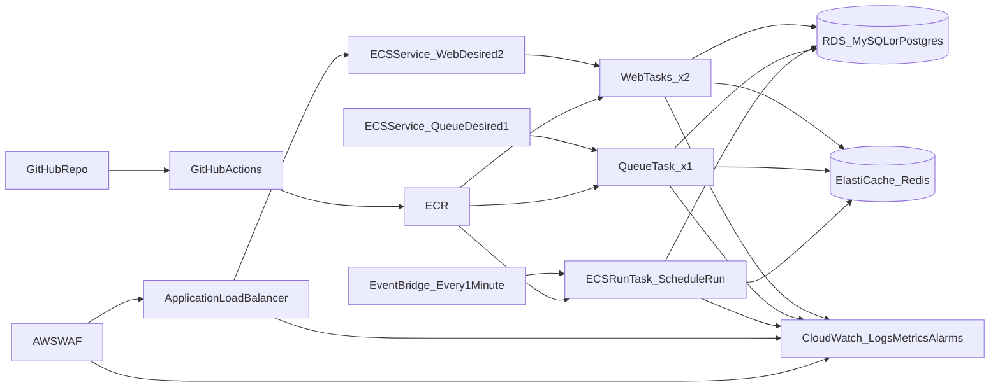

# Laravel on ECS (Fargate)

This guide shows how we deploy a Laravel backend to AWS using **GitHub Actions → ECR → ECS on Fargate**, with an **ALB**, **WAF**, **RDS**, **ElastiCache Redis**, **CloudWatch** observability, and an **EventBridge** scheduler for `php artisan schedule:run`.

## What you’re building

- **Web**: ECS service behind an ALB, desired count **2**
- **Queue**: ECS service (no load balancer), desired count **1**
- **Scheduler**: EventBridge rule (every minute) that triggers **ECS RunTask** running `php artisan schedule:run`
- **Data**: RDS (MySQL or PostgreSQL) + ElastiCache Redis
- **Observability**: CloudWatch logs, metrics, alarms, dashboards
- **Cost safety**: AWS Budgets alerts

## Architecture diagram



## AWS resources checklist

### Security baseline (IAM + perimeter)

- **GitHub Actions → AWS (OIDC)**:
  - Prefer AWS IAM Identity Provider + role assumption via GitHub OIDC.
  - Keep permissions least-privilege: ECR push + ECS deploy for only the target repo/cluster/service.
- **ECS roles**:
  - **Task execution role**: pull image from ECR, write logs to CloudWatch.
  - **Task role**: read only the required secrets/parameters (SSM/Secrets Manager paths).
- **Tagging**:
  - Standardize tags like `env`, `service`, `owner`, `cost-center` so cost allocation and budgets work.

### Networking

- **VPC** with:
  - 2+ **public subnets** (ALB)
  - 2+ **private subnets** (ECS tasks, RDS, Redis)
- **Security groups** (tight by default):
  - ALB → web tasks (HTTP target port only)
  - Web/queue/scheduler → RDS (DB port only)
  - Web/queue/scheduler → Redis (6379 only)
- **Egress / NAT**:
  - If tasks need outbound internet (package installs at runtime are discouraged; AWS API calls, external HTTP calls, etc.), ensure NAT is present or use VPC endpoints where appropriate.

### Edge protection (WAF on ALB)

- Associate an **AWS WAF Web ACL** to the ALB.
- Start with **AWS Managed Rules** (baseline):
  - `AWSManagedRulesCommonRuleSet` (general protections)
  - Add SQLi/XSS-focused managed rules as needed for your traffic profile
- Add a **rate limit** rule (sane starting threshold, tune after observing).
- Enable **WAF logging** (pick one path and standardize it):
  - CloudWatch Logs directly, or
  - Kinesis Data Firehose → S3 (often better for long retention)

### ECR

- One ECR repo per service or one repo per backend (either is fine; keep it consistent).
- Add a lifecycle policy (retain last N images or last N days).

### ECS/Fargate

- ECS cluster
- Task definitions:
  - Same image, different **commands** for web vs queue; scheduler uses **RunTask** with a one-off command.
  - CloudWatch Logs configuration per container.
- Services:
  - `backend-web`:
    - desired count **2**
    - attached to ALB target group
  - `backend-queue`:
    - desired count **1**
    - no load balancer

### RDS (MySQL or PostgreSQL)

- Decide engine based on team preference and existing operational comfort.
- Baselines to document and enable:
  - automated backups + retention
  - Multi-AZ (when you need HA)
  - maintenance window + minor version upgrades policy
  - security group restricted to ECS task security group

> **Note:** keep RDS and Redis private. Do not expose them publicly.

### ElastiCache Redis

- Single-node vs replication group depends on availability needs.
- Lock down access via security groups.

## Application configuration (Laravel)

### Where to store secrets

- Store app secrets in **SSM Parameter Store** or **AWS Secrets Manager**.
- Inject into ECS as environment variables from those sources:
  - `APP_KEY`, `APP_ENV`, `APP_DEBUG`, `APP_URL`
  - `DB_CONNECTION`, `DB_HOST`, `DB_PORT`, `DB_DATABASE`, `DB_USERNAME`, `DB_PASSWORD`
  - `REDIS_HOST`, `REDIS_PORT`, `REDIS_PASSWORD` (if applicable)

### Sessions, cache, queues

- For multi-task web services, prefer shared backends:
  - `CACHE_DRIVER=redis`
  - `SESSION_DRIVER=redis` (or database) so sessions survive task replacement
  - `QUEUE_CONNECTION=redis`

### Files and uploads

- Treat container storage as **ephemeral**.
- Use S3 (Laravel filesystem) for uploads and persistent files.

## Sample Dockerfiles (copy/paste)

The simplest model is a **single production image** and you change behavior via the ECS `command`:

- **Web**: run the HTTP runtime
- **Queue**: run `php artisan queue:work ...`
- **Scheduler** (RunTask): run `php artisan schedule:run ...`

> **Note:** If you need Nginx in the same task, keep it simple and deterministic (health checks must pass quickly). If your org already standardizes on ALB → Nginx → PHP-FPM in one container/task, follow that standard.

### Option A (recommended): one image, multiple commands

`Dockerfile` (example; adjust PHP version, extensions, and build steps to your app):

```dockerfile
FROM php:8.3-fpm-alpine AS base

WORKDIR /var/www/html

RUN apk add --no-cache \
    bash \
    curl \
    icu-dev \
    libzip-dev \
    oniguruma-dev \
    && docker-php-ext-install intl pdo pdo_mysql pdo_pgsql zip opcache

COPY --from=composer:2 /usr/bin/composer /usr/bin/composer

COPY composer.json composer.lock ./
RUN composer install --no-dev --prefer-dist --no-interaction --no-progress

COPY . .

RUN php artisan package:discover --no-interaction || true

COPY docker/entrypoint.sh /entrypoint.sh
RUN chmod +x /entrypoint.sh

EXPOSE 9000

ENTRYPOINT ["/entrypoint.sh"]
CMD ["php-fpm"]
```

`docker/entrypoint.sh`:

```bash
#!/usr/bin/env bash
set -euo pipefail

if [[ "${APP_ENV:-}" != "local" ]]; then
  php artisan config:cache --no-interaction || true
  php artisan route:cache --no-interaction || true
  php artisan event:cache --no-interaction || true
fi

exec "$@"
```

ECS commands:

- Web service command (typical):

```bash
php-fpm
```

- Queue service command:

```bash
php artisan queue:work --sleep=3 --tries=3 --timeout=90 --no-interaction
```

- Scheduler RunTask command:

```bash
php artisan schedule:run --verbose --no-interaction
```

### Option B: separate Docker targets (if you prefer explicit entrypoints)

You can also keep one Dockerfile with multiple targets (web/queue) and tag separately. Only do this if it’s meaningfully clearer for your team.

## GitHub Actions (build → push to ECR → deploy)

This is a working pattern; adapt it to your repo layout.

Key points:

- Prefer **OIDC** to assume an AWS role.
- Tag images with both **git SHA** and **latest** (or an env-specific moving tag).
- Deploy by updating the ECS service to the new task definition revision.

```yaml
name: Deploy (dev)

on:
  push:
    branches: [main]

permissions:
  id-token: write
  contents: read

concurrency:
  group: deploy-dev
  cancel-in-progress: true

jobs:
  deploy:
    runs-on: ubuntu-latest
    steps:
      - uses: actions/checkout@v4

      - name: Configure AWS credentials (OIDC)
        uses: aws-actions/configure-aws-credentials@v4
        with:
          role-to-assume: ${{ secrets.AWS_ROLE_TO_ASSUME }}
          aws-region: ${{ secrets.AWS_REGION }}

      - name: Login to ECR
        uses: aws-actions/amazon-ecr-login@v2

      - name: Build and push image
        env:
          ECR_REPO: ${{ secrets.ECR_REPOSITORY }}
          IMAGE_TAG: ${{ github.sha }}
        run: |
          docker build -t "$ECR_REPO:$IMAGE_TAG" -t "$ECR_REPO:latest" .
          docker push "$ECR_REPO:$IMAGE_TAG"
          docker push "$ECR_REPO:latest"

      - name: Deploy to ECS
        env:
          CLUSTER: ${{ secrets.ECS_CLUSTER }}
          SERVICE: ${{ secrets.ECS_SERVICE_WEB }}
        run: |
          aws ecs update-service --cluster "$CLUSTER" --service "$SERVICE" --force-new-deployment
```

> **Note:** For stronger guarantees, prefer “render task definition JSON with the new image tag” and deploy that revision, rather than relying on a moving tag.

## Rolling deployment + rollback mechanics (ECS)

- **ALB health check**:
  - Use a simple endpoint that verifies the app is up (example `/up` or `/health`).
  - Ensure it does not require auth and is fast.
- **ECS deployment circuit breaker**:
  - Enable circuit breaker with rollback so failed deployments revert automatically.
- **Deployment tuning**:
  - Set `minimumHealthyPercent` and `maximumPercent` to match your desired rollout speed.
  - Use scale-in/scale-out cooldowns so you don’t flap under burst traffic.

## Scheduler (EventBridge → ECS RunTask every minute)

- Create an EventBridge rule: `rate(1 minute)`
- Target: ECS RunTask
  - Task definition: same image
  - Command override: `php artisan schedule:run --verbose --no-interaction`
  - Network: same private subnets + security group as the app
- Guardrails to include:
  - Reasonable EventBridge retry policy
  - Prevent overlapping schedule runs if your scheduled tasks are long-running (Laravel patterns + locking)

## Database migrations

Run migrations as a **one-off ECS task**:

```bash
php artisan migrate --force --no-interaction
```

Document how you trigger it (manual RunTask in console, or a protected workflow step) and how you handle rollback.

## Horizontal auto scaling

### Web service (`backend-web`)

- Example scaling bounds: **min 2**, **max 10**
- Target tracking options (choose 1–2 to start):
  - CPU utilization (example target **60%**)
  - Memory utilization (example target **70%**)
  - ALB request count per target (great for burst traffic; tune per app)
- Include cooldown guidance to avoid flapping.

### Queue service (`backend-queue`)

- Example scaling bounds: **min 1**, **max 10**
- Best signal: **queue backlog**
  - Export Redis queue length as a **custom CloudWatch metric**
  - Scale based on “messages per worker” (target tracking) or step scaling
- Fallback signal: CPU utilization (only if backlog metric isn’t ready)

## Observability (CloudWatch)

### Logs

- Send application logs to stdout/stderr and collect via CloudWatch Logs.
- Separate log groups for:
  - web
  - queue
  - scheduler RunTask

### Metrics and alarms (starter set)

- **ALB**: 5xx rate, target response time, unhealthy host count
- **ECS**: CPU/memory utilization, task restarts, deployment failures
- **RDS**: CPU, free storage, DB connections
- **Redis**: memory, evictions
- **Queue depth**: custom metric (if using backlog-based scaling)

## Billing alerts

- Create an **AWS Budget** for this environment:
  - monthly actual cost threshold (email/SNS)
  - forecast threshold (email/SNS)
- Optional: Cost Anomaly Detection for unexpected spikes.

## TLS and DNS (external DNS provider + ACM)

- Provision an **ACM certificate** in the same region as the ALB.
- Attach the certificate to the ALB HTTPS listener.
- In your external DNS provider:
  - Create a record pointing your domain to the ALB (CNAME where supported; follow provider constraints for apex domains).

## References

### Internal

- [DevOps Stack](/docs/devops)
- [Docker](/docs/devops/docker)
- [GitHub Actions](/docs/devops/github-actions)

### External

- [Amazon ECS Developer Guide](https://docs.aws.amazon.com/AmazonECS/latest/developerguide/Welcome.html)
- [Application Load Balancers](https://docs.aws.amazon.com/elasticloadbalancing/latest/application/introduction.html)
- [AWS WAF Developer Guide](https://docs.aws.amazon.com/waf/latest/developerguide/)
- [Amazon EventBridge Scheduler / rules](https://docs.aws.amazon.com/eventbridge/latest/userguide/eb-rules.html)
